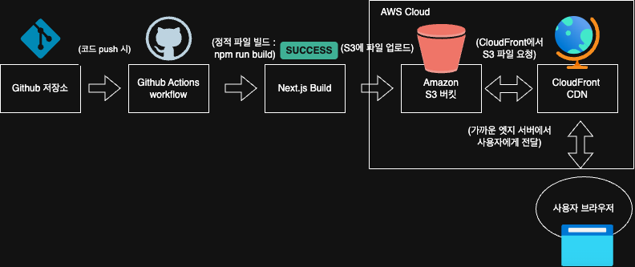

# 🪄 프론트엔드 배포 파이프라인 – `next-s3-cdn-practice`

## 개요

이 프로젝트는 Next.js로 개발된 웹 애플리케이션을 AWS S3 + CloudFront를 활용하여 정적 배포하는 자동화 파이프라인입니다.
main 브랜치에 코드가 푸시되면 GitHub Actions 워크플로우를 통해 자동으로 빌드 및 배포가 수행됩니다.

---

## 정적 웹사이트 배포 구조

본 프로젝트는 다음과 같은 구성으로 정적 자산을 자동 배포합니다:

```text
[GitHub 저장소]
   ↓ (코드 Push)
[GitHub Actions]
   ↓ (next build)
[Next.js 정적 파일]
   ↓ (aws s3 sync)
[Amazon S3 버킷]
   ↓ (CloudFront origin 요청 및 캐싱)
[Amazon CloudFront]
   ↓ (전 세계 엣지 서버에서 배포)
[사용자 브라우저]
```

---

## 워크플로우 단계

1. GitHub Actions에서 `main` 브랜치 push 감지
2. `checkout`액션으로 코드 다운로드
3. `npm ci` → 의존성 설치
4. `next build` → 정적 파일(`out/`) 생성
5. AWS 자격 증명 구성
6. `aws s3 sync` → S3에 정적 파일 업로드
7. `aws cloudfront create-invalidation` → CDN 캐시 무효화

---

## 주요 링크

| 항목                        | 링크                                                               |
| --------------------------- | ------------------------------------------------------------------ |
| S3 버킷 웹사이트 엔드포인트 | http://dn-practice-hj-0527.s3-website.ap-northeast-2.amazonaws.com |
| CloudFront 배포 도메인      | https://d1dp7q1h3uhnyu.cloudfront.net                              |

---

## 주요 개념 정리

### GitHub Actions (CI/CD)

- `.github/workflows/deployment.yml` 파일에 배포 스크립트를 정의
- `push` 또는 `workflow_dispatch` 트리거로 자동 실행

### AWS S3

- `next build` 결과물을 저장하는 정적 파일 호스팅 공간
- `aws s3 sync` 명령어로 업로드

### AWS CloudFront

- 전 세계 엣지 로케이션을 활용한 콘텐츠 전송 네트워크 (CDN)
- 지정된 원본인 S3에서 콘텐츠를 가져와 캐싱
- create-invalidation 명령어로 캐시 갱신 처리

### Repository Secrets

- `AWS_ACCESS_KEY_ID`, `AWS_SECRET_ACCESS_KEY`, `S3_BUCKET_NAME`, `CLOUDFRONT_DISTRIBUTION_ID` 등은 GitHub Secrets에 등록하여 안전하게 관리

---

## 구성 요소 설명

| 구성 요소                | 설명                                                                       |
| ------------------------ | -------------------------------------------------------------------------- |
| **GitHub 저장소**        | 개발자가 작성한 소스 코드가 관리되는 공간입니다.                           |
| **Next.js Build 결과물** | GitHub Actions를 통해 정적 파일로 빌드(`npm run build`)된 HTML, JS, CSS 등 |
| **Amazon S3**            | 빌드된 정적 파일을 업로드하고 저장하는 공간입니다.                         |
| **Amazon CloudFront**    | 전 세계 엣지 로케이션을 통해 콘텐츠를 캐싱하여 빠르게 전달하는 CDN입니다.  |
| **사용자 브라우저**      | 최종 사용자에게 빠르게 콘텐츠를 제공받는 최종 지점입니다.                  |

---

## 배포 요약 및 특징

- 자동화된 빌드 및 배포: CI/CD 도구인 GitHub Actions로 완전 자동화
- 빠른 사용자 응답속도: CloudFront가 가까운 엣지 서버에서 캐싱된 자산 전달
- 비용 효율: 서버리스 구조로 S3 + CDN 만으로 고성능 제공

---

### 배포 효과

- 정적 자산을 캐싱하고 배포하는 실제 흐름을 직접 구성하며 CDN 개념을 체감할 수 있었습니다.
- 배포 캐시 무효화 타이밍과 구조를 명확히 이해할 수 있었습니다.
- 실무에서도 응답 속도 개선, 자동화된 배포 환경 구성 등으로 확장할 수 있는 기반을 마련했습니다.

---

### 배포 다이어그램

배포 흐름을 시각적으로 정리한 다이어그램입니다.



---

## 실습 정보

| 항목        | 내용                                             |
| ----------- | ------------------------------------------------ |
| 프로젝트명  | `next-s3-cdn-practice`                           |
| 배포 대상   | AWS S3 + CloudFront                              |
| 배포 트리거 | GitHub Actions (main 브랜치 push)                |
| 주요 기술   | Next.js, GitHub Actions, AWS CLI, S3, CloudFront |
